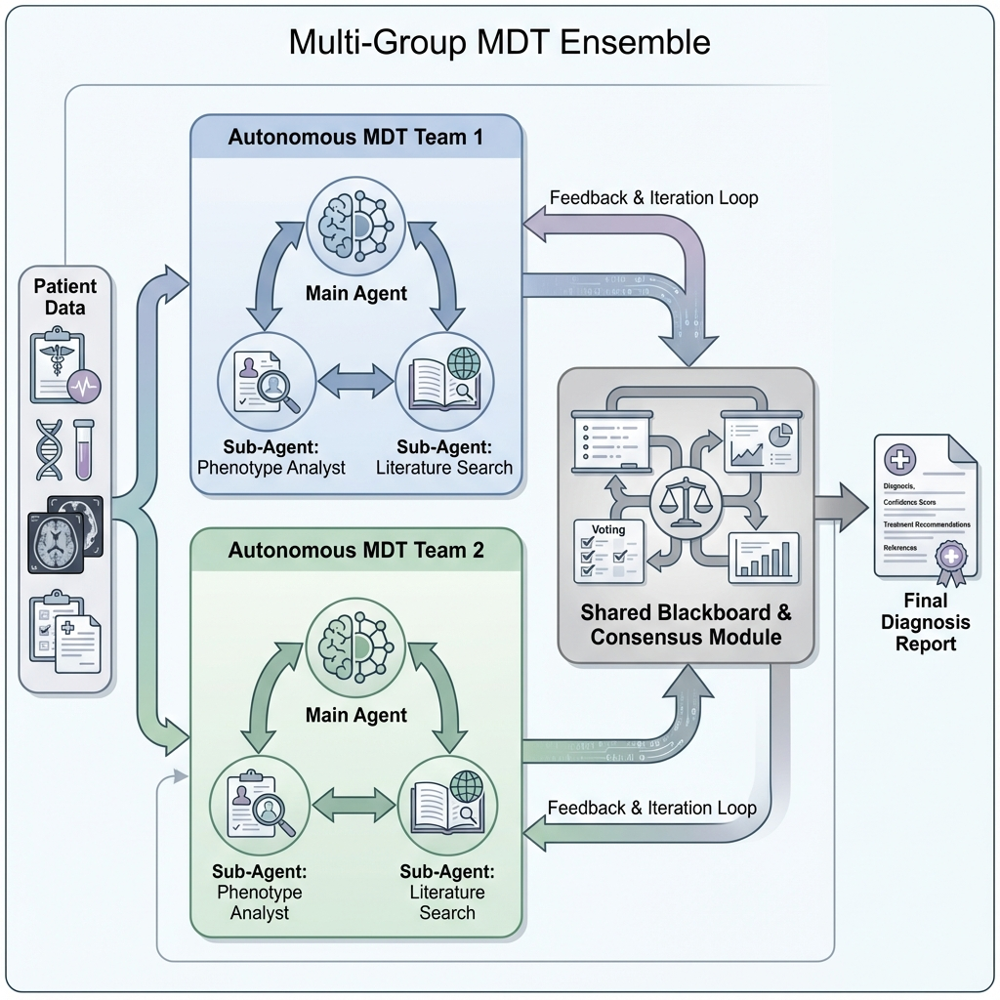
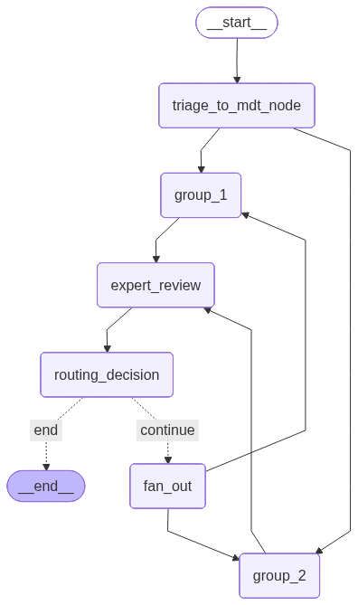

<p align="center">
  
</p>

# DeepRareAgent

**面向罕见病诊断的多组 MDT 集成系统 (Multi-Team MDT Ensemble for Rare Disease Diagnosis)**

---

## 项目简介

**DeepRareAgent** 是一个专为罕见病诊断设计的 AI 辅助系统。其核心不是简单的"一条路"诊断，而是模拟医院里由多个独立团队参与的 **多团队多学科会诊 (Multi-Team MDT)** 机制。

**核心思想**：让多个"全能"的 MDT 团队各自独立分析同一个复杂病例，然后将各团队的诊断意见进行交叉验证与迭代拟合，最终输出一份高置信度的综合报告。




> **运行注意事项**: 通常项目无法正常运行是由于所选模型能力不足导致的。预诊断模型（Pre-Diagnosis Agent）不支持图像识别（Vision），将会导致多模态图像输入功能报错。请务必在 `config.yml` 中为相关 Agent 配置支持对应能力（如 GPT-4o, Claude-3.5-Sonnet, Qwen-VL 等）的模型。
---

## 系统图谱架构 (System Graph Schema)

本系统基于 **LangGraph** 构建，采用状态机（State Graph）模式管理诊断流程。整体流转逻辑如下：



**流程详解**：
1.  **START -> Pre-Diagnosis**: 系统启动，进入预诊断节点，与患者进行交互式问诊（收集基本信息、症状、病史等）。
2.  **Conditional Routing**:
    *   **Wait (No)**: 如果信息不足或患者未确认开始诊断，流程暂停（`__end__`），等待用户下一轮输入（Human-in-the-loop）。
    *   **Proceed (Yes)**: 当触发 `trigger_deep_diagnosis` 工具时，状态标记为 `start_diagnosis=True`，流程自动流转至下一步。
3.  **Prepare MDT**: 对前期的医患对话进行语义总结，生成结构化的病情摘要（Context）。
4.  **MDT Subgraph**: 进入多团队 Muti-Agent 会诊阶段（核心诊断逻辑）。
5.  **Summary**: 整合 MDT 阶段的所有专家报告，生成最终诊断书。

---

## 核心特性

### 1. 多智能体团队并行 (Multi-Team Parallelism)

系统可配置 **N 个独立的诊断组 (Group)**。每一个 Group（如 `group_1`, `group_2`）并不是单一的模型，而是一个**完整的多学科会诊团队 (MDT Unit)**，内部包含负责不同职能的多个 Agent。

> 💡 **现状说明**: 目前基于研究进度，系统仅预设了两个标准化的诊断组作为 Baseline。后续将针对特定罕见病领域（如神经遗传病、代谢病等）进行进一步开发，引入经过领域微调的专科诊断组。

每个 Group 的典型结构如下：

| 角色 | 说明 |
|---|---|
| **Main Agent (主控)** | 负责整体诊断规划、逻辑整合与报告撰写。 |
| **Sub-Agent 1 (Phenotype Analyst)** | 负责调用 HPO 表型本体工具，将症状标准化。 |
| **Sub-Agent 2 (Literature Researcher)** | 负责调用 PubMed、搜索引擎等工具检索证据。 |

每个团队**独立进行**从症状分析、文献检索到报告输出的完整流程，彼此不干扰。

### 2. 共识与拟合 (Consensus & Fitting)

所有团队完成诊断后，系统不会简单取平均或投票。而是：
1.  **Expert Review Node**: 一个专门的节点负责对比各组报告，提取冲突点和共同认知。
2.  **Blackboard (公共黑板)**: 各组报告、分歧与共识会被发布到黑板上。
3.  **多轮迭代 (Multi-Round Loop)**: 如果共识未达成，系统会启动新一轮诊断，各组阅读黑板上的信息后重新分析，直到达成共识或轮数耗尽。

### 3. 三阶段流程

整个系统分为三个主要阶段：

| 阶段 | 节点 | 功能 |
|---|---|---|
| **P01: Pre-Diagnosis** | `prediagnosis` | 智能问诊，收集患者基本信息、症状、家族史。当信息足够时，判断是否需要启动深度诊断。 |
| **P02: MDT Diagnosis** | `mdt_diagnosis` (子图) | 多组专家并行分析，经过多轮迭代达成共识。 |
| **P03: Summary** | `summary` | 整合所有专家组报告，生成最终的综合诊断报告。 |

---

## 项目结构

```
DeepRareAgent/
├── DeepRareAgent/
│   ├── graph.py                    # 主图定义 (P01 -> P02 -> P03)
│   ├── schema.py                   # 状态定义 (MainGraphState, MDTGraphState, ExpertGroupState)
│   ├── p01pre_diagnosis_agent.py   # 预诊断智能体
│   ├── p02_mdt/
│   │   ├── graph.py                # MDT 子图定义
│   │   ├── builddeepexportnode.py  # 专家组节点工厂 (构建 Main/Sub Agent 级联)
│   │   ├── nodes.py                # 路由、扇出等辅助节点
│   │   └── export_reviwer_node.py  # 专家互审/共识节点
│   ├── p03summary_agent.py         # 汇总报告节点
│   ├── tools/                      # 各类工具 (HPO, PubMed, 搜索等)
│   └── prompts/                    # 各智能体的系统提示词
├── config.yml                      # 主配置文件 (模型、API Key、Group 定义)
└── langgraph.json                  # LangGraph 服务配置
```

---

## 快速开始

### 1. 安装依赖

```bash
pip install -e . "langgraph-cli[inmem]"
```

### 2. 配置

```bash
# 复制配置模板
cp config.example.yml config.yml
cp .env.example .env

# 编辑 config.yml，填入你的 LLM API Key 和 Base URL
```

### 3. 启动服务

```bash
langgraph dev
```

*   **API**: `http://127.0.0.1:2024`
*   **LangGraph Studio**: `https://smith.langchain.com/studio/?baseUrl=http://127.0.0.1:2024`

---

## 配置说明

在 `config.yml` 中，`multi_expert_diagnosis_agent` 下的每个 `group_*` 都是一个独立的诊断团队。你可以：
*   增加或减少 Group 数量。
*   为每个 Group 配置不同的模型（如 group_1 用 GPT-4，group_2 用 Claude）。
*   为每个 Sub-Agent 配置不同的工具集。

```yaml
multi_expert_diagnosis_agent:
  group_1:
    main_agent:
      name: "Clinical_Lead_G1"
      model_name: "gpt-4o"
      ...
    sub_agent:
      sub_agent_1:  # Phenotype Analyst
        ...
      sub_agent_2:  # Literature Researcher
        ...
  group_2:
    # ... 同上，可使用不同模型
```

---

## 📚 参考与评估 (References & Benchmarking)

DeepRareAgent 的设计与验证参考了以下 2024-2025 年的顶刊与前沿工作：

| 来源 | 论文/项目 | 核心贡献与评估体系 |
| :--- | :--- | :--- |
| **ArXiv '24** | **RareAgents** (Chen et al.) | 提出了罕见病 MDT 框架，使用 **RareBench (1,197 病例)** 进行 Top-K 准确率评估，是本项目的直接对标基准。 |
| **Nature '25** | **AMIE** (Google) | 定义了 AI 问诊的黄金标准：**模拟问诊 (Simulated Consultations)** 与双盲随机对照试验 (RCT)。 |
| **ArXiv '25** | **MDTeamGPT** | 验证了多 Agents 在 MDT 场景下的共识机制，使用 MedQA 和 PubMedQA 评估，并引入了人类专家 blind review。 |
| **ArXiv '25** | **DiagnosisArena** | 超越简单问答，使用 1,113 个结构化病例评估 Agent 的 **诊断推理路径 (Reasoning Paths)**。 |
| **NEJM AI '25** | **MedAgentBench** | 在虚拟 EHR 环境中测试 Agent 模拟医生全流程操作的能力（开药、查病历）。 |
| **NeurIPS '24** | **MDAgents** | 提出了 "Adaptive Collaboration"，证明了根据病例难度动态调整 Agent 数量的有效性。 |

---

## 🔮 2026 创新路线图 (Future Roadmap)

为了应对 2026 年的学术挑战，本项目计划在以下维度进行架构升维：

### 1. 认知架构升级：对抗性协作 (Adversarial Collaboration)
*   引入 **"Red Team" (红队)** 机制：在共识达成前，强制实例化一个"反对者"智能体，专门寻找诊断逻辑漏洞。
*   **目的**：解决群体思维 (Groupthink) 和级联幻觉，从单纯的"达成共识"进化为"经得起挑战的真理"。

### 2. Neuro-Symbolic 融合：知识图谱与病例库 (Proposed)
*   **Knowledge Graph Agent**: 接入生物医学知识图谱 (如 Hetionet, PrimeKG)，进行确定性的多跳逻辑推理，弥补 LLM 的概率性缺陷。
*   **Similar Case Retrieval Agent**: 基于 Case-Based Reasoning (CBR) 思想，检索历史相似病例库，提供"循证"支持。

### 3. 多模态原生 (Native Multimodal)
*   扩展输入的维度，支持 **VCF 基因数据** 的直接解析与 **医学影像 (DICOM)** 的特征提取，将文本诊断扩展为多模态综合诊断。

### 4. 可信 AI：诊断归因图 (Diagnostic Attribution)
*   输出结果不再是单一文本，而是包含证据溯源的 **归因图**，明确每一条诊断结论引用的具体文献、指南条款或图谱节点。

---
## 后续任务
- [ ] 支持定制总结报告(已经实现后端支持，前端还需要优化(比如增加一个患者信息展示的区域。))
- [ ] 采用一个方案将本研究目前的工具拆分成若干个智能体(实现真正的MDT)
- [ ] 知识图谱子智能体(初始化实现方案neo4jmcp+deepagents或者借鉴文献实现该功能)
- [ ] 私有病例数据集支持智能体 (考虑是FHIR还是直接采用sql数据库简单实现)
- [ ] 患者信息升级多模态数据集管理
- [ ] 个人变异文件支持智能体 
- [ ] 利用 get_stream_writer 、构建模型或者请求时候使用 tags=["poem"] 可以为流式请求增加一些定制化的返回信息。


补充一些信息.
关于 get_stream_writer Access LangGraph StreamWriter from inside a graph node or entrypoint task at runtime.


## 许可证

MIT License - 详见 [LICENSE](LICENSE)文件