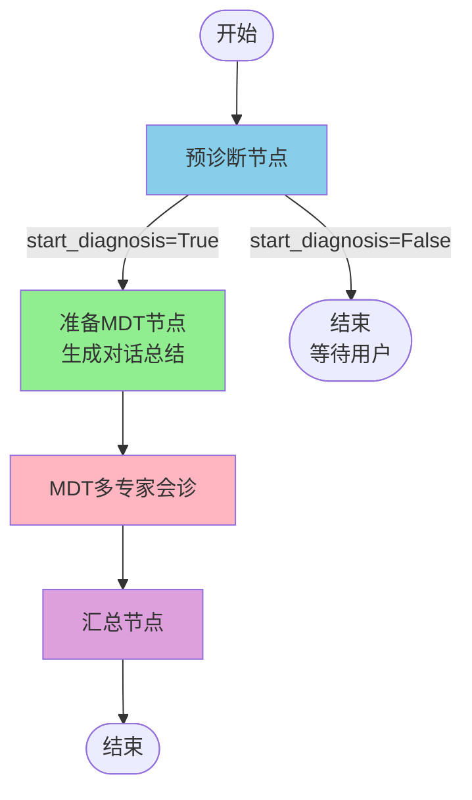

# DeepRareAgent 系统结构说明

## 当前主图结构



## 节点详细说明

### 1. **预诊断节点** (`prediagnosis`)
- **文件**: `DeepRareAgent/p01pre_diagnosis_agent.py`
- **模型配置**: `settings.pre_diagnosis_agent`
  - Provider: `anthropic` (或 openai)
  - Model: `mimo-v2-flash` (配置文件中定义)
  - Temperature: `0.2`
- **功能**:
  - 与用户对话收集患者信息
  - 调用工具管理患者信息（症状、病史等）
  - 检测是否满足深度诊断条件
  - 调用 `trigger_deep_diagnosis` 工具触发诊断
- **状态更新**:
  - `patient_info`: 通过工具的 Command 更新
  - `start_diagnosis`: 通过 `trigger_deep_diagnosis` 的 Command.PARENT 更新主图
- **输出**: 最后一条AI消息

### 2. **准备MDT节点** (`prepare_mdt`) ⭐ **新增**
- **文件**: `DeepRareAgent/graph.py` (第38-112行)
- **模型配置**: 复用 `settings.pre_diagnosis_agent`
  - 原因：生成对话总结是轻量级任务，与预诊断使用相同配置合理
  - 未来可考虑添加专门配置：`prepare_mdt_agent`
- **功能**:
  - 检查是否已有对话总结（避免重复生成）
  - 从对话历史生成结构化摘要
  - 为MDT专家组提供上下文
- **关键解决的问题**:
  - `trigger_deep_diagnosis` 通过 `Command.PARENT` 直接更新主图
  - 预诊断节点无法捕获 `start_diagnosis` 变化
  - 改为在主图路由阶段生成总结
- **输出**:
  - `summary_with_dialogue`: 对话总结文本
  - `messages`: 提示消息

### 3. **MDT多专家会诊** (`mdt_diagnosis`)
- **文件**: `DeepRareAgent/p02_mdt/graph.py`
- **子图结构**:
  ```
  triage_to_mdt → [专家组并行] → expert_review → routing_decision
                                                          ↓
                                                    end | continue(fan_out)
  ```
- **模型配置**: 每个专家组独立配置
  - **Group 1**:
    - Main Agent: `GLM-4.7` (via aiping.cn)
    - Sub Agents: `GLM-4.7`
  - **Group 2**:
    - Main Agent: `MiniMax-M2.1` (via aiping.cn)
    - Sub Agents: `MiniMax-M2.1`
- **功能**:
  - 初始化专家组，分发患者信息和对话总结
  - 各专家组并行诊断研究
  - 专家互审和辩论
  - 多轮迭代直至达成共识
- **输入**:
  - `patient_info`: 结构化患者信息
  - `summary_with_dialogue`: **从 prepare_mdt 接收** [PASS]
  - `patient_portrait`: 患者画像文本
- **输出**:
  - `expert_pool`: 各专家组的诊断报告和证据
  - `blackboard`: 公共黑板（发布的报告）
  - `consensus_reached`: 是否达成共识

### 4. **汇总节点** (`summary`)
- **文件**: `DeepRareAgent/p03summary_agent.py`
- **模型配置**: `settings.summary_agent`
  - Provider: `openai`
  - Model: `Pro/deepseek-ai/DeepSeek-V3.2`
  - Temperature: `0.1` (较低，确保一致性)
- **功能**:
  - 整合所有专家组的诊断结果
  - 生成最终的综合诊断报告
  - 包含证据链、鉴别诊断、建议等
- **输出**:
  - `final_report`: 最终诊断报告

## 配置文件结构 (`config.yml`)

```yaml
# 预诊断配置
pre_diagnosis_agent:
  provider: "anthropic"  # 或 "openai"
  model_name: "mimo-v2-flash"
  base_url: "https://api.xiaomimimo.com/anthropic"
  api_key: "YOUR_API_KEY"
  temperature: 0.2
  model_kwargs:
    max_tokens: 8000
  system_prompt_path: "DeepRareAgent/prompts/prediagnosisprompt.txt"

# MDT专家组配置
multi_expert_diagnosis_agent:
  group_1:
    max_input_tokens: 80000
    main_agent:
      name: "Clinical_Lead_G1"
      provider: "openai"
      model_name: "GLM-4.7"
      base_url: "https://aiping.cn/api/v1"
      # ... 其他配置
    sub_agent:
      sub_agent_1:  # Phenotype_Analyst
      sub_agent_2:  # Literature_Researcher
  
  group_2:
    # 类似结构

# MDT系统配置
mdt_config:
  max_rounds: 3  # 最大会诊轮数

# 汇总配置
summary_agent:
  provider: "openai"
  model_name: "Pro/deepseek-ai/DeepSeek-V3.2"
  temperature: 0.1
```

## 模型工厂 (`utils/model_factory.py`)

统一的模型创建接口，支持：
- **OpenAI 兼容**: DeepSeek, GLM (通过base_url)
- **Anthropic 兼容**: Claude, GLM-4 (通过base_url)

使用方式：
```python
from DeepRareAgent.utils.model_factory import create_llm_from_config

model = create_llm_from_config(settings.pre_diagnosis_agent)
```

## 关键数据流

### 对话总结传递流程 [PASS] **已修复**

```
预诊断 (收集对话)
    ↓
start_diagnosis=True (通过Command.PARENT更新主图)
    ↓
prepare_mdt (生成总结)
    ↓ summary_with_dialogue
MDT triage (接收总结)
    ↓ 分发到专家组
各专家组 (使用总结作为上下文)
```

### 患者信息流

```
预诊断工具 (PatientInfoManager)
    ↓ Command 更新
主图 patient_info
    ↓ 传递
MDT 各节点
    ↓ 格式化
patient_portrait (文本形式)
```

## 未来优化建议

1. **专门的总结配置**
   ```yaml
   prepare_mdt_agent:
     provider: "openai"
     model_name: "gpt-4o-mini"
     temperature: 0.3
   ```

2. **总结质量检查**
   - 验证总结包含关键字段（主诉、症状、病史）
   - 长度检查

3. **缓存机制**
   - 对相同对话历史缓存总结结果

4. **增量更新**
   - 长对话分段总结

## 开发者注意事项

[WARN] **Command更新机制**:
- 工具返回 `Command(update={...}, graph=Command.PARENT)` 会直接更新主图
- 节点的 `result` 中**无法捕获**这些更新
- 需要在主图层面处理状态转换

[PASS] **最佳实践**:
- 使用 `model_factory.create_llm_from_config()` 创建模型
- 在配置文件中集中管理所有模型参数
- 添加清晰的日志便于调试
- 处理异常并提供降级方案
